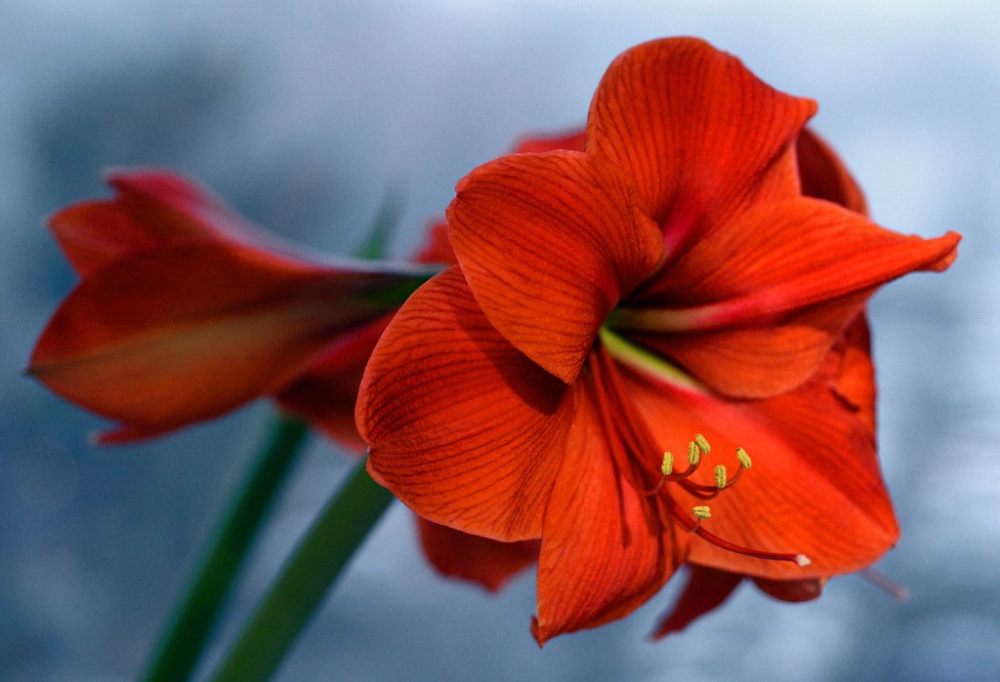

# OpenCV: image recognition & feature detection in Python

#### my goal: learn python (numpy, pandas, OpenCV) with a focus on robotic applications

## Corner Detection Algorithms
This project implements classic corner detection algorithms such as:

- [Moravec Corner Detector](https://mahendrathapa.medium.com/moravec-corner-detector-5191f1c04b30)
- [Harris Corner Detector](https://docs.opencv.org/2.4/doc/tutorials/features2d/trackingmotion/harris_detector/harris_detector.html)

### Feature- or Descriptor-Matching
- [FAST: Features from Accelerated Segment Test](https://docs.opencv.org/4.x/df/d0c/tutorial_py_fast.html)
- SIFT: Scale-invariant feature transform
- SURF: Speeded Up Robust Features
- MSER: Maximally Stable Extremal Regions
- BRIEF: Binary Robust Independent Elementary Features
- ORB:Oriented FAST and Rotated BRIEF

How the Matching works:
1. Features (keypoints) like corners or edges are detected.
2. For every keypoint a descriptor is calculated (a descriptor describes the local surrounding of its feature. This is useful if the camera moved, the image was rotated or scaled. A descriptor is most often a vector)
3. To calculate the similarity of two descriptors (from two images), you calculate the distance between the vectors (e.g. euclidian distance for SIFT, SURF & Hamming distance for binary descriptors from ORB, BRIEF).

### Template Matching
- Sum of Absolute Differences (SAD)
- Sum of Squared Differences (SSD)
- Normalized Cross-Correlation (NCC)

How the Matching works:
Similar to the feature / descriptor matching, you try to match two very similar imagepatches (Pixelblöcke) with each other. But instead of detecting a feature, you simply take the template which you want to find in the other image and use a sliding window to scan the whole image for the template. [Click here for more info](https://docs.opencv.org/4.x/d4/dc6/tutorial_py_template_matching.html)

## Filter
Using convolution with a filter on a grayscale image, you can detect edges in an image. The value which is displayed in a grayscale image is the intensity (Helligkeit).
- Sobel
- LaPlace
- Gaussian → smoothing
- Canny
- Kalman
  
#### Filter combinations

- Laplacian of Gaussian (LoG) = Laplace after Gauss

## other algorithms
- Nearest Neighbors (kNN)
- RANSAC
- ReLu

## Parameters of a camera
- f: focal length
- disparity
- K: camera calibration matrix
- resolution
- distance to object

## More complex algorithms
- [SLAM](https://www.youtube.com/watch?v=saVZtgPyyJQ) 
## How to use this project?

Open the notebook `corner_detector.ipynb` to see the detectors in action.

